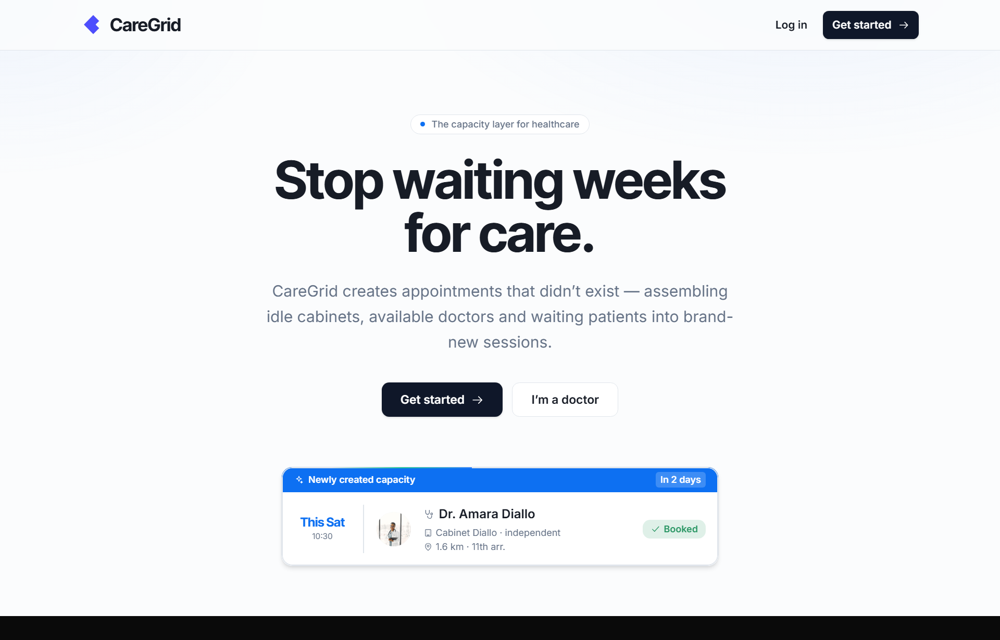
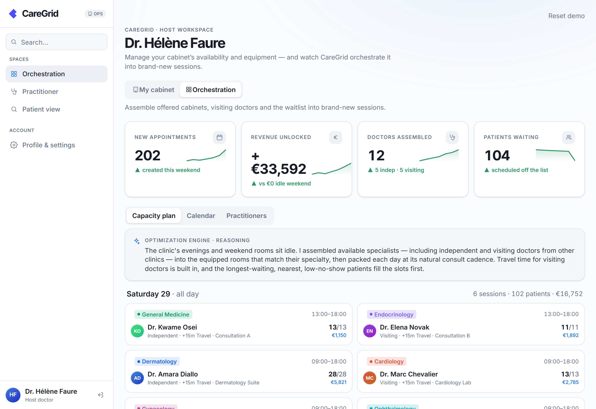
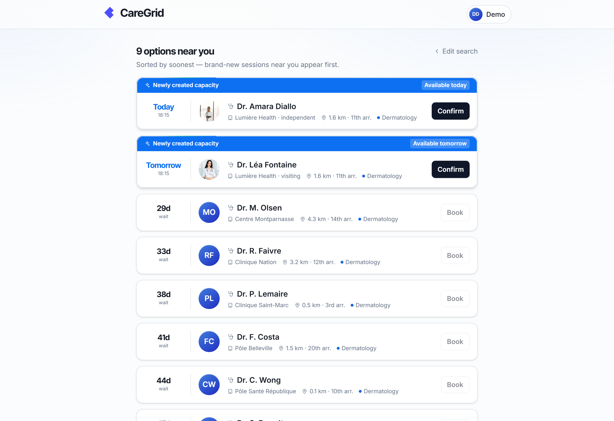
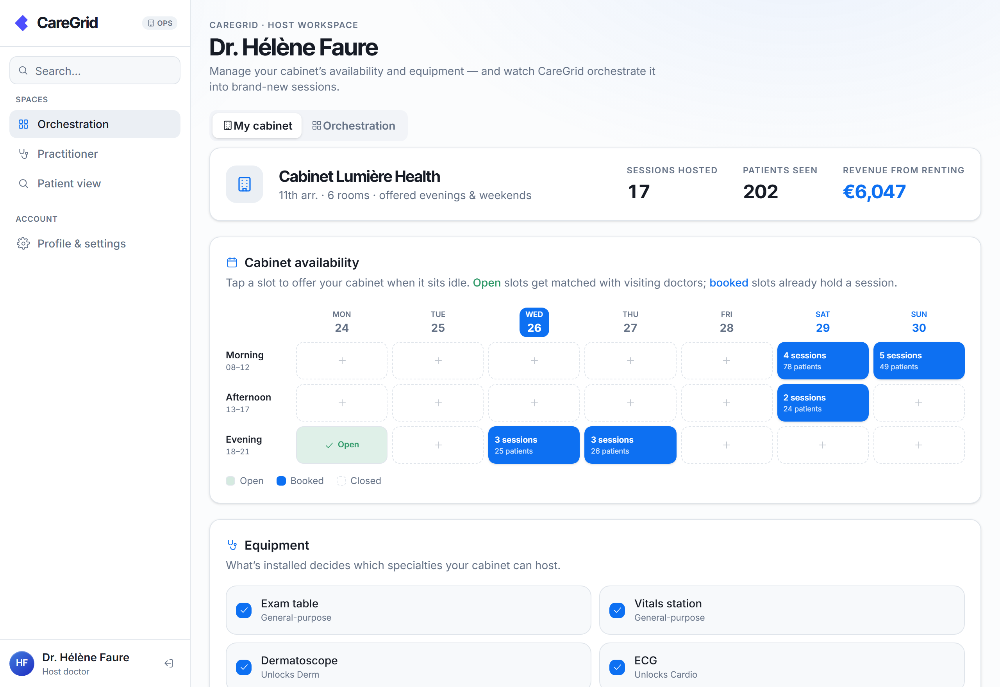
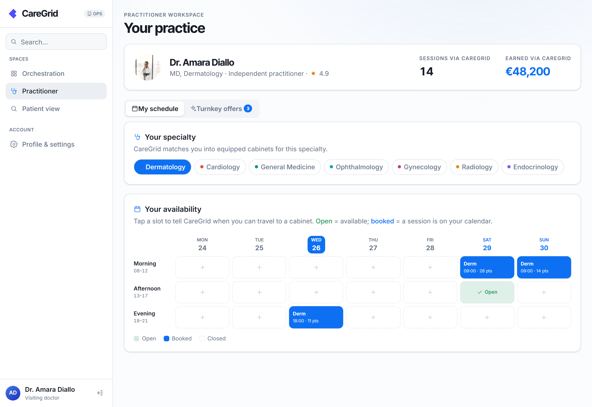

<p align="center">
  
</p>

<h1 align="center">CareGrid</h1>

<p align="center"><b>The AI capacity layer underneath healthcare booking.</b></p>

<p align="center"><i>Doctolib books appointments that exist. CareGrid creates appointments that didn't exist yesterday.</i></p>

<p align="center">
  Paris Builds (Y Combinator × Unaite) · Track: <b>The Next Big Decacorn</b><br>
  🎥 <b>Demo video:</b> <i>add your link before submitting</i> &nbsp;·&nbsp; 📊 <b>Pitch deck:</b> <i>attached as PDF in the submission</i>
</p>

---

## The problem

In France, a patient waits weeks — often months — for a specialist. Meanwhile, equipped consultation rooms sit empty every evening and every weekend, and qualified doctors have open hours they can't fill.

The capacity already exists. It's just never assembled.

> Healthcare doesn't only need more buildings. It needs smarter capacity **orchestration**.

## What CareGrid does

Booking platforms like Doctolib help patients book appointments that **already exist**. CareGrid is different — **we create appointments that did not exist before.**

CareGrid's AI coordinates unused rooms, available practitioners, staff, patient waitlists, no-show risk and operational constraints, and assembles them into brand-new, optimized consultation sessions — the right specialist, in an equipped room, packed with the patients who've waited longest nearby.

**We don't build new clinics. We unlock the capacity that already exists.**

## How it works — three sides, one engine

Three things already exist but never meet. CareGrid brings them together:

| | |
|---|---|
| 🏛️ **Host doctor** | Owns a cabinet that's idle evenings & weekends — and offers it (equipment + open windows). |
| 🩺 **Visiting doctor** | A specialist willing to consult in someone else's cabinet (travel time accounted for). |
| 🧑 **Patient** | On a waitlist, searching for a specialty near them. |

The engine assembles **offered cabinet + available doctor + waiting patients → a session that didn't exist.**

## The orchestration engine

CareGrid is **not a search filter** — it's an orchestration engine that reasons over the live state of a care network and composes sessions that satisfy every real-world constraint at once.

A **reasoning model acts as the planner**: given the current state of the network — which rooms are idle, what each room is equipped for, which practitioners are free and where, and what the waitlist actually demands — it decides *where new capacity can be created, and why.* A **deterministic solver** then turns that strategy into a concrete schedule through a set of coordinated stages:

- **Match** — pair each idle, equipped room-window with an available practitioner whose specialty the room's equipment supports (a room with no MRI can't host radiology).
- **Route** — fold in real travel time for visiting and independent doctors, so the plan is physically possible, not just theoretically optimal.
- **Pack** — fill each session slot-by-slot at that specialty's true consult cadence (dermatology 15 min, cardiology 30 min, …) for full, realistic days.
- **Prioritize** — seat the longest-waiting, nearest, lowest-no-show-risk patients from the waitlist first.

It's built to coordinate the full set of signals a real clinic juggles — **rooms, practitioners, staff, equipment, waitlists, no-show risk, travel and operational constraints** — and resolve them into appointments that didn't exist. One click turns idle evenings and weekends into a packed, revenue-positive plan.

<p align="center"></p>

<p align="center"><sub><i>Example run: one weekend of idle capacity → <b>202 new appointments · 17 sessions · +€33,592</b>, assembling 12 doctors (5 independent, 5 visiting) — equipment respected, travel built in, every day packed.</i></sub></p>

## Inside the product

### For patients — care in days, not months
A guided search (specialty, urgency, location). Results are **sorted by soonest**: brand-new CareGrid capacity appears first — *available today or tomorrow* — while existing clinics sit weeks out. Confirm, check out, done.

<p align="center"></p>

### For host doctors — your empty cabinet, working
Offer your idle morning/afternoon/evening slots on a weekly board, toggle the equipment you have — which decides the specialties your cabinet can host — and see every session booked into it.

<p align="center"></p>

### For visiting doctors — turnkey sessions
Set your specialty and availability; CareGrid hands back fully-arranged sessions at cabinets that aren't yours — room, patients, equipment and billing organized, travel and payout shown. One tap to accept.

<p align="center"></p>

## Run it locally

```bash
npm install

# Optional — enable the live AI planner:
cp .env.example .env.local      # then set ANTHROPIC_API_KEY=...

npm run dev                     # http://localhost:3000
```

Open **http://localhost:3000**, click **Get started**, and pick a role (Patient · Host doctor · Visiting doctor) — any email signs you in. Best viewed at ~1280px.

**Routes:** `/` landing · `/app` patient · `/appointments` · `/clinic` host workspace · `/doc` visiting doctor · `/profile`.

## Built with

Next.js 16 (App Router) · TypeScript · Tailwind CSS v4 · shadcn/ui · Radix · Motion · a server-side reasoning model for the orchestration planner. Minimal, near-monochrome design with a single medical-blue accent; Inter / Inter Tight type.
